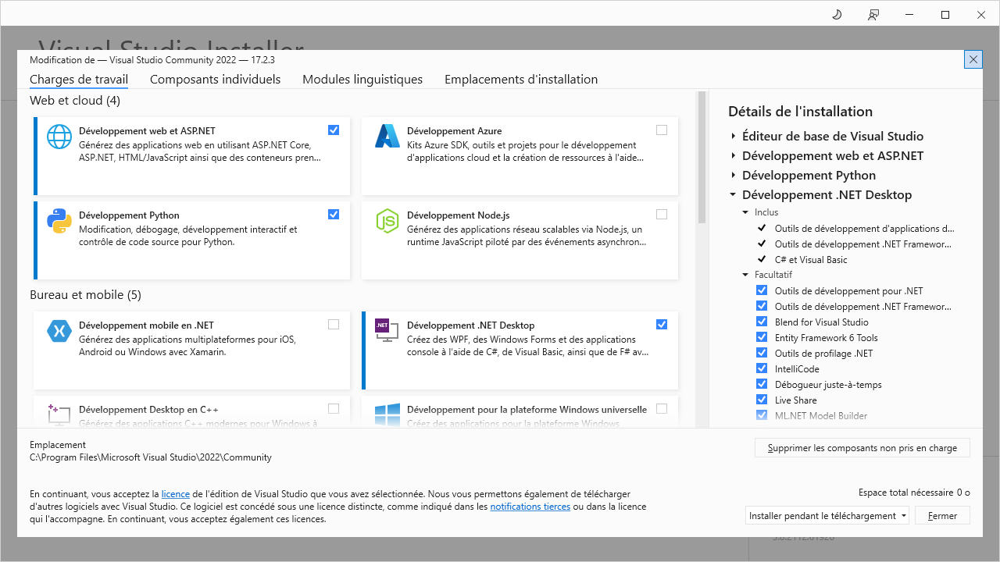
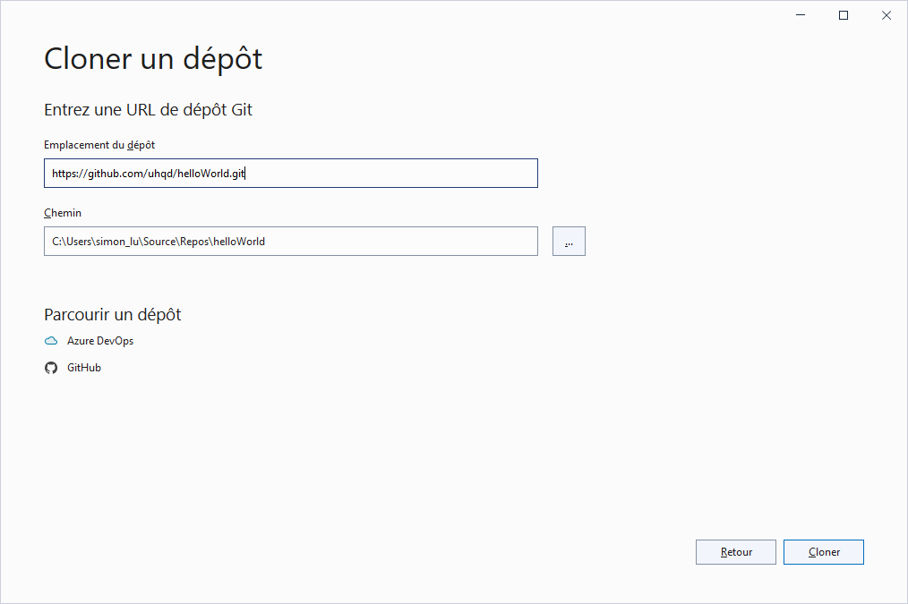
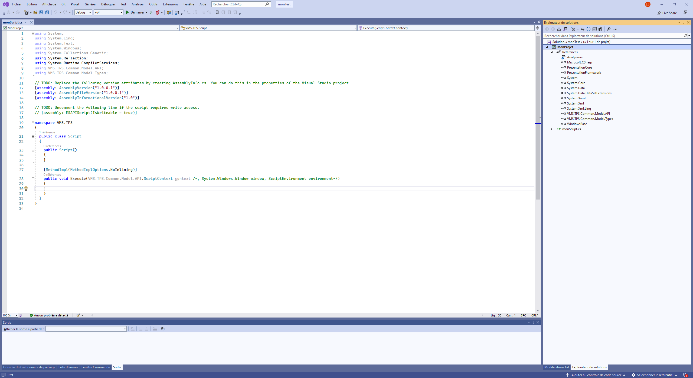

# ESAPI For Dummies

This is a very simple introduction for very beginners: how to start step by step a Varian Eclipse Script (ESAPI)
ESAPI scripts allow to automatize routine tasks in Varian Eclipse (Treatment Planification module)
This repository only contains this README file. It should help very beginners to start their first script ESAPI for VARIAN Eclipse.
I tried to make it as simple and as short as possible.
If this first step is understood, readers will be able to download and try all the script available from my github account (or other users)

## 1. Install Visual Studio
First install on your computer (Windows) a free version of Visual Studio. I recommend  [Visual Studio Community 2022](https://visualstudio.microsoft.com/fr/vs/community/)

**Important**: during installation, select the installation of **.NET Desktop** option. This operation should last 2-5 minutes. 

**Important**: DO NOT INSTALL **VISUAL STUDIO CODE**, but Visual Studio (it is a different product)

Visual Studio is the perfect application to develop your scripts. 

Close Visual Studio if it is open. You will open it, during the next following steps. 

Now you are ready to start. Let's see two easy way to say Hello with a simple script in Eclipse: from github and using the wizard. Try both in the following order. 

##  2. Install and execute your first script from a github repository
### Cloning a repo (if you do not know github)
Find a github repository (repo) containing an ESAPI script, made by other users that you want to try.
In this example, we will take a very simple public repo: [https://github.com/uhqd/helloWorld](https://github.com/uhqd/helloWorld)

On the repository github page, click on the button **CODE** and copy the https link. In our example: https://github.com/uhqd/helloWorld.git

On your computer, create an empty directory. This directory must be visible from your Eclipse Station (to be executed).

Open Visual Studio and select from the first Window: "Cloning a repository" (I trnslate the french version, so messages can be slightly different). A window is displayed

Paste in the first field the *https link* and in the second field, the complete path to your empty directory (the project will be downloaded in this directory), then click **Clone**

Close Visual Studio.

If you take a look on the directory, you will find several downloaded files/dir. You do not need to understand what are these files for the moment.
One of this file is .sln file (Visual Studio Solution)
### Building your project
Double click on this .sln file to open it on Visual Studio. 
Here, you may have (or not) to do the following operations. On the Visual Studio (VS) right panel (Solution Explorer) you will find a list of references (some needed files to execute your script)

Find the 2 reference files VMS.TPS.Common.Model.API and VMS.TPS.Common.Model.Types

They are provided by VARIAN to access the information you can get and the actions you can do in Eclipse from your script.

If you are lucky you have the good version of these files for your Eclipse version (and you have nothing to do)

### Changing ESAPI dlls
If a yellow danger triangle is drawn on these files you have to change them: 
- right click on them and delete them
- right click on **references** and "add references..." and browse your computer to find the correct references.
  You will find them on your Eclipse station on a path that should be something like (depending on your Aria Version):
  
C:\Program Files(x86)\Varian\RTM\15.6\esapi\API\VMS.TPS.Common.Model.API
  
C:\Program Files(x86)\Varian\RTM\15.6\esapi\API\VMS.TPS.Common.Model.Types

Once it is done, you can build you solution 

On the Menu bar, select **Generate**, then **Generate Solution**

Visual Studio is building your project and in the output window (bootom) it writes where is created your final product the .esapi.dll file. 

You can test in Eclipse: select **Tools**, then **Scripts**, then change directory to select the direcory where your .esapi.dll is (Please notice that Eclipse does not ask you to select directly the .esapi.dll file but the directory that contains it).

Once you have choose the correct directrory, select you "plugin" (the .esapi.dll)  and Execute it.

Eclipse should say you hello!

### Modify your script
If you want to modify the script, please follow the following steps : 

##  2. Install and execute your first script using the Varian Wizard
On a Eclipse Station, in the START menu of Windows, find the **Eclipse Script Wizzard** (it should be in the VARIAN directory).

The wizzard is able to generate an empty project to start scripting very easily.

When starting the Wizzard you have to choose:
- an empty directory to start your project (this directory must be visible from your Eclipse Station, to be executed).
- a name of the project
- a type of Script. I only detail here 3 types of these proposed scripts :
  * Binary plugin: the general recommanded type to make an ellaborated scrit. The previous [example](https://github.com/uhqd/helloWorld) is a binary plugin script. For this tutorial, please select this type.
  * Single file plugin: a simple project with only one .cs file (for simple project). This type doesnt require any compilation or solution building.
  * stand alone script. This type of script can be executed on a Eclipse Station, without opening ARIA. You can find a documented example of this script here: [Dose Hunter](https://github.com/uhqd/DoseHunter.git)

When clicking ok, the wizard will generate a set of files in the empty directory. It proposes to open VS, say no.

Please follow carefully the following instructions in this order:
- double clic on the .csproj file  (this should be in *your directrory*/Projects/*your project name*
- it opens Visual Studio
- On the right panel, check if the 2 dll (VMS.TPS...) are correct. To change them, see the prvious subsection **Changing ESAPI dlls**
- On the right panel, double click on the .cs file to display it (the place you start scripting)
- You can add your code after the comment line // TODO : Add.... For exemple : 

     

